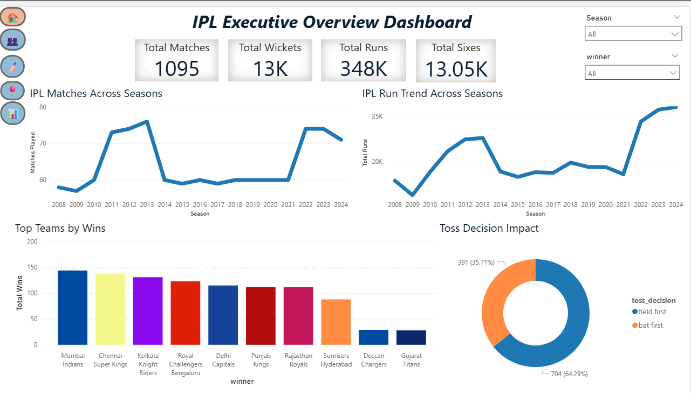
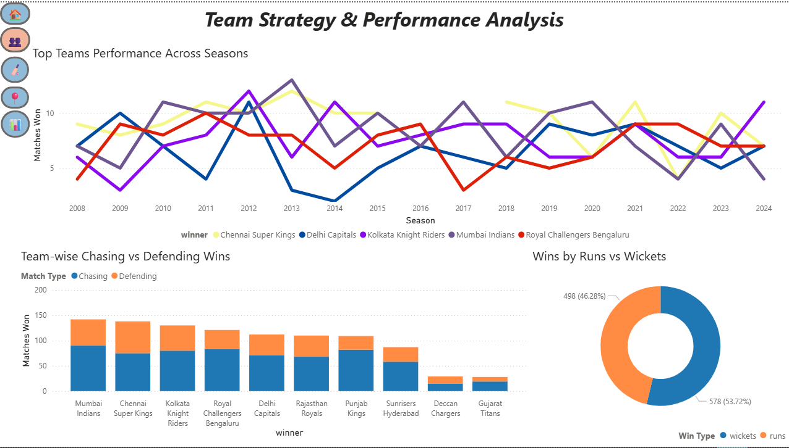
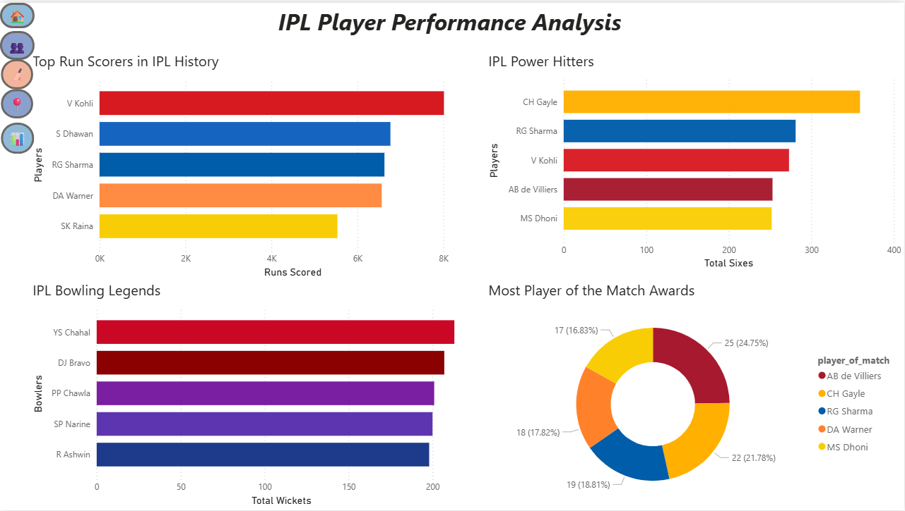
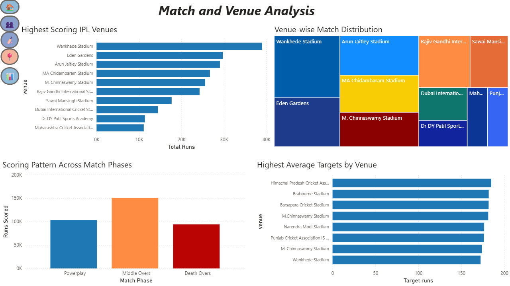
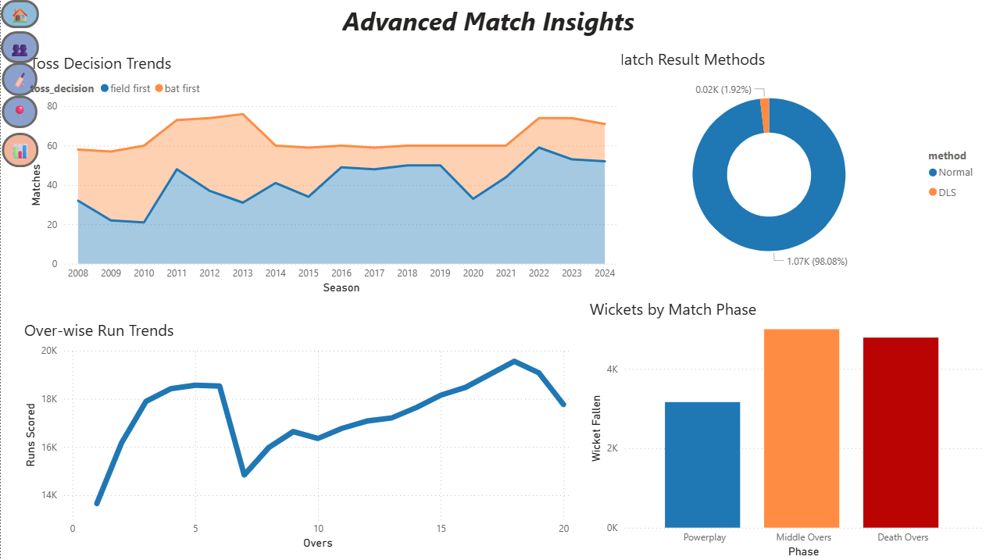

# IPL Power BI Analysis Dashboard

## Project Overview

This project is an end-to-end IPL analytics dashboard developed using Power BI. The dashboard transforms raw IPL match and ball-by-ball datasets into interactive visual insights focused on team performance, player statistics, venue analysis, toss decisions, scoring patterns, and strategic match trends across IPL seasons.

The objective of the project was to perform data cleaning, data modeling, visualization, and insight generation using business intelligence techniques and storytelling principles.

---

## Tools and Technologies

* Power BI
* Power Query
* DAX
* CSV Datasets
* GitHub

---

## Dashboard Features

### Executive Overview

* Total Matches, Runs, Wickets, and Sixes KPIs
* IPL match trends across seasons
* Run trends over multiple IPL seasons
* Toss decision analysis
* Top teams by total wins

### Team Strategy & Performance Analysis

* Team performance trends across seasons
* Chasing vs defending analysis
* Wins by runs vs wickets comparison
* Team consistency insights

### Player Performance Analysis

* Top run scorers in IPL history
* IPL power hitters analysis
* Leading wicket takers
* Player of the Match award analysis

### Match & Venue Analysis

* Highest scoring IPL venues
* Venue-wise match distribution
* Scoring patterns across match phases
* Average target analysis by venue

### Advanced Match Insights

* Toss decision trends over seasons
* Match result method analysis
* Over-wise run trends
* Wicket distribution by match phases

### Strategic Insights & Conclusions

* Player insights
* Team insights
* Venue insights
* Match insights

---

## Dashboard Screenshots

### Executive Overview

### Team Analysis

### Player Analysis

### Match & Venue Analysis

### Advanced Insights

### Strategic Insights

---

## Key Insights Generated

* Mumbai Indians and Chennai Super Kings have been the most successful IPL franchises.
* Virat Kohli leads the IPL all-time run scoring charts.
* Teams increasingly prefer chasing after winning the toss.
* Death overs create the highest scoring intensity in matches.
* Venues such as Wankhede Stadium and Eden Gardens consistently produce high-scoring games.

---

## Repository Contents

* Power BI Dashboard File (.pbix)
* IPL Dataset
* Dashboard Screenshots
* Project Documentation

---

## Author

Vidit Bhutani

Aspiring Data Analyst | Power BI Enthusiast | Economics Student
