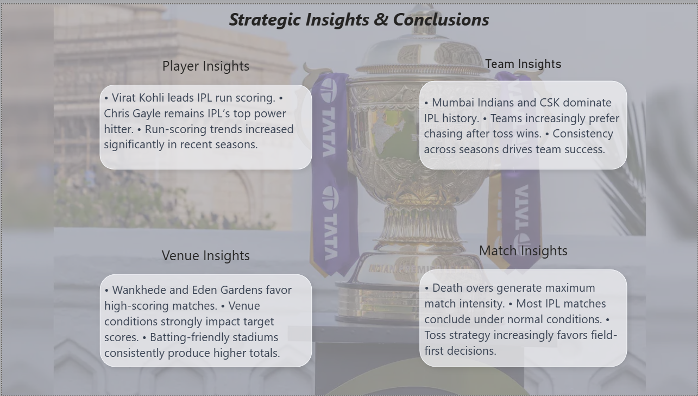

#  IPL Power BI Analysis Dashboard

##  Project Overview

This project is an interactive IPL (Indian Premier League) analytics dashboard built using Power BI.
The dashboard provides detailed insights into team performance, player statistics, venue analysis, toss decisions, match trends, and strategic IPL patterns across multiple seasons.

The project focuses on transforming raw cricket data into meaningful business-style insights using interactive visualizations and storytelling techniques.

---

#  Features

* Executive Overview Dashboard
* Team Performance Analysis
* Player Performance Insights
* Match & Venue Analysis
* Advanced IPL Trends
* Strategic Insights & Conclusions
* Interactive Slicers & Navigation
* Multi-page Analytical Reporting

---

#  Tools & Technologies Used

* Power BI
* Power Query
* DAX
* Excel / CSV Datasets
* GitHub

---

#  Dashboard Pages

## 1️ Executive Overview

* Total Matches
* Total Runs
* Total Wickets
* Toss Decision Trends
* Seasonal Performance Trends

---

## 2️ Team Analysis

* Team Performance Across Seasons
* Chasing vs Defending Analysis
* Wins by Runs vs Wickets
* Team Strategy Insights

---

## 3️ Player Analysis

* Top Run Scorers
* IPL Power Hitters
* Leading Wicket Takers
* Player of the Match Awards

---

## 4️ Match & Venue Analysis

* Highest Scoring Venues
* Venue-wise Match Distribution
* Runs by Match Phase
* Average Target Scores by Venue

---

## 5️ Advanced Insights

* Toss Decision Trends
* Match Result Methods
* Over-wise Run Trends
* Wickets by Match Phase

---

## 6️ Strategic Insights & Conclusions

* Batting Insights
* Team Insights
* Venue Insights
* Match Insights

---

#  Dashboard Screenshots

## Executive Overview

---

## Team Analysis

---

## Player Analysis

---

## Match & Venue Analysis

---

## Advanced Insights

---

## Strategic Insights

---

#  Key Insights Generated

* Mumbai Indians and Chennai Super Kings dominate IPL history.
* Virat Kohli leads IPL run scoring charts.
* Teams increasingly prefer chasing after winning the toss.
* Death overs generate maximum match intensity.
* Certain venues consistently produce high-scoring matches.

---

#  Files Included

* Power BI Dashboard (.pbix)
* IPL Dataset
* Dashboard Screenshots
* Project Documentation

---

#  Author

## Vidit Bhutani

Aspiring Data Analyst | Power BI Enthusiast | Economics Student

---
